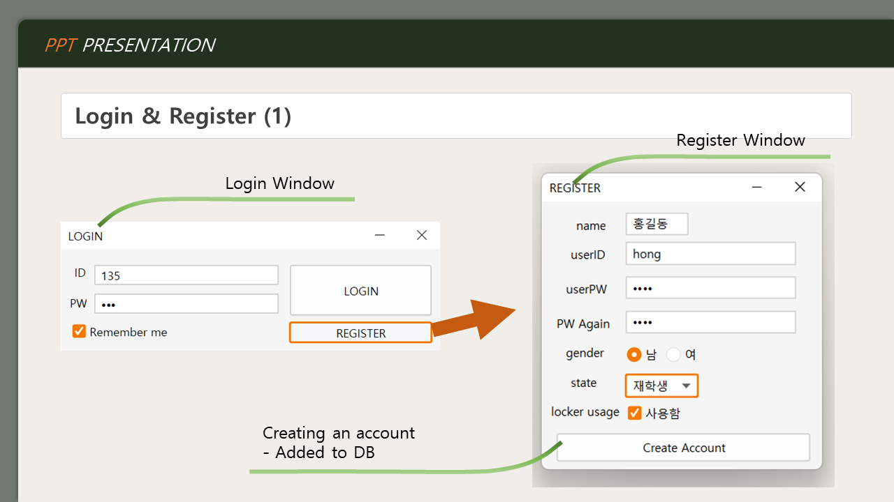
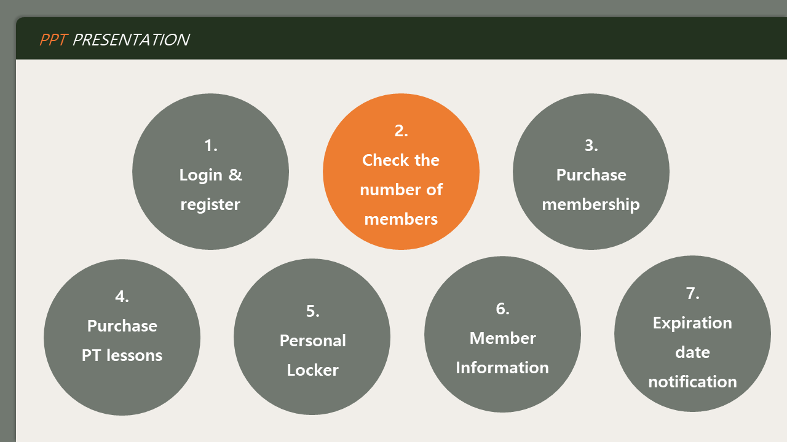

:pushpin:프로젝트명
------------
학교 스포츠센터 회원관리 프로그램

:heavy_check_mark:개발 기간
-------------
2022년 9월 7일 ～ 2022년 12월 14일

:heavy_check_mark:개발 목적
-----------------
- 스포츠센터를 사용하는 사용자들의 편의 증진에 도움을 주기 위해 개발
- 스포츠센터 내에서 운영 중인 스포츠 프로그램에 대한 이용권, 개인락커, 강습 등록 등의 시스템을 자동화
- 사용자들의 사용 정보를 통계내고 사용 시간대와 같은 사용 성향을 파악한 정보를 사용자들에게 제공

:heavy_check_mark:작품의 주요 기능
----------------
1. 로그인 & 회원가입
2. 회원수 확인
3.  헬스장 회원권 구매
4. PT권 구매
5. 개인 락커
6. 회원정보 확인
7. 만료일 알림

:heavy_check_mark:실행 방법
------------
- IntelliJ에서 File -> Project Settings -> Libraries -> ``flatlaf-2.6``, ``flatlaf-intellij-themes-2.6``, ``mysql-connector-j-8.0.31`` 추가하기
- ``gui의 loginPage.java`` 파일 실행

:heavy_check_mark:발표 자료
-----------
    
  
  
  

  
  
  
  
  
  
  
  
  
  
  
  
  
  
  
  

